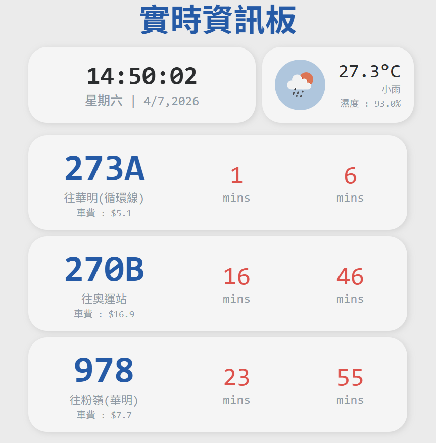
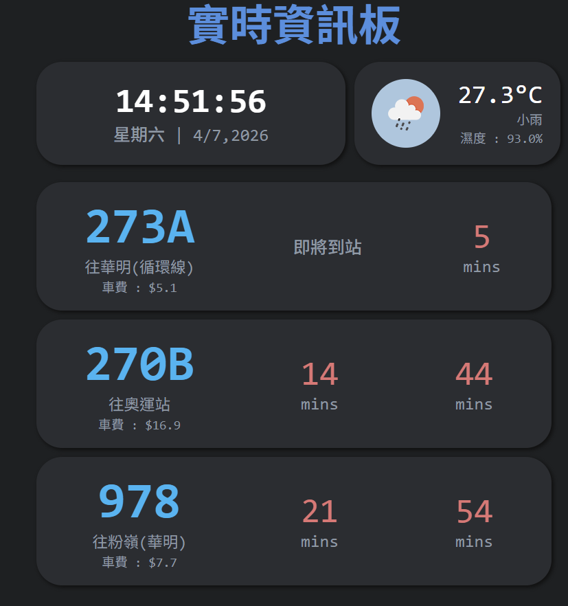

# 🚌 Real-Time Bus Information Dashboard

A simple dashboard designed for iPad and large-screen displays that provides:

- 🚌 Real-time KMB bus arrival information
- 🌤 Live weather information
- 🕒 Digital clock and date
- 🌙 Automatic dark mode at night

The project is built entirely with:

- HTML
- CSS
- JavaScript 

No frontend frameworks are required.

## Live Demo
[Live Demo](https://avistsang.github.io/live_dashboard/)

## Preview

### Information Displayed

#### Time & Date

- Current time (updates every second)
- Current date and weekday

#### Bus ETA

- Route number
- Destination
- Fare
- Next two arrival times
- Service suspension detection

#### Weather

- Current temperature
- Weather condition
- Humidity
- Weather icon

#### Theme

- Light mode (06:00 - 18:00)
- Dark mode (18:00 - 06:00)

---

## Features

### Real-Time KMB ETA

Bus arrival information is retrieved from the KMB ETA Open Data API.

Examples:

```text
273A
往 華明

3 mins
15 mins
```

If no ETA is available:

```text
暫停服務!
```

If the bus is arriving:

```text
即將到站
```

---

### Weather Information

Weather data is provided by OpenWeather API.

Displays:

- Temperature
- Weather description
- Humidity
- Weather icon

Example:

```text
31.4°C

陰天

濕度 : 81%
```

---

### Automatic Theme Switching

The dashboard automatically switches themes based on system time.

```javascript
18:00 - 05:59
→ Dark Mode

06:00 - 17:59
→ Light Mode
```

---

## Project Structure

```text
project/
│
├── index.html
├── style.css
├── script.js
└── README.md
```

---

## APIs Used

### KMB ETA API

```text
https://data.etabus.gov.hk/
```

Used for:

- Bus ETA
- Destination information

---

### OpenWeather API

```text
https://openweathermap.org/api
```

Used for:

- Temperature
- Weather condition
- Humidity
- Weather icon


## Future Improvements

- [ ] Rain forecast
- [ ] Wind speed
- [ ] Feels-like temperature
- [ ] Bus route search
- [ ] Configurable routes
- [ ] Public transport interchange information
- [ ] Multiple stop support
- [ ] PWA support
- [ ] Touch-friendly settings page

---

## Screenshots

Add screenshots here after deployment.

Light Mode:



Dark mode : 


---

## Author

Created by **Avis**

Personal project for learning:

- JavaScript
- API integration
- Dashboard UI Design
- Responsive Web Development

---

## License

This project is provided for educational and personal use.
